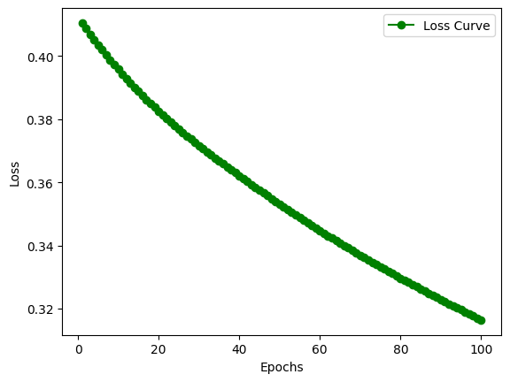

# ❤️ Heart Disease Prediction using Artificial Neural Networks

A Deep Learning project that predicts whether a patient is at risk of heart disease using an Artificial Neural Network (ANN) built with PyTorch and deployed with Streamlit.

---

## 📌 Overview

This project uses patient medical information such as age, cholesterol, blood pressure, ECG results, chest pain type, and other clinical attributes to classify whether the patient has heart disease.

The model is trained using PyTorch and integrated with a Streamlit web application for real-time predictions.

---

## 🚀 Features

- Binary Heart Disease Prediction
- Artificial Neural Network built from scratch
- PyTorch implementation
- Data preprocessing using Scikit-learn Pipeline
- Interactive Streamlit Web App
- Probability-based prediction
- Responsive user interface

---

## 🧠 Neural Network Architecture

Input Layer
↓
Linear (Input → 64)
↓
ReLU
↓
Linear (64 → 32)
↓
ReLU
↓
Linear (32 → 1)
↓
Sigmoid (Inference)

---

## 📊 Dataset

**Source:** Kaggle

The dataset contains patient health records including:

- Age
- Sex
- Chest Pain Type
- Resting Blood Pressure
- Cholesterol
- Fasting Blood Sugar
- Resting ECG
- Maximum Heart Rate
- Exercise-Induced Angina
- Oldpeak
- ST Slope

Target:

- 0 → Normal
- 1 → Heart Disease

---

## 📈 Model Performance

| Metric | Value |
|---------|--------|
| Problem Type | Binary Classification |
| Framework | PyTorch |
| Optimizer | Adam |
| Loss Function | BCEWithLogitsLoss |
| Epochs | 100 |
| Test Accuracy | **85.29%** |

---

## 📉 Training Loss

The model shows smooth convergence during training.

<p align="center">

</p>

---

## 🛠️ Tech Stack

- Python
- PyTorch
- Streamlit
- Scikit-learn
- Pandas
- NumPy
- Joblib

---

## 📂 Project Structure

```
Heart-Disease-ANN/
│
├── app.py
├── heart_disease_model.pth
├── preprocessor.pkl
├── loss.png
├── requirements.txt
├── README.md
```

---

## ▶️ Run Locally

Clone the repository

```bash
git clone https://github.com/TheGhostLoop/Heart-Disease-Predictor.git
```

Install dependencies

```bash
pip install -r requirements.txt
```

Run the application

```bash
streamlit run app.py
```

---

## 👨‍💻 Author

**Prince**

If you found this project useful, feel free to ⭐ the repository.
